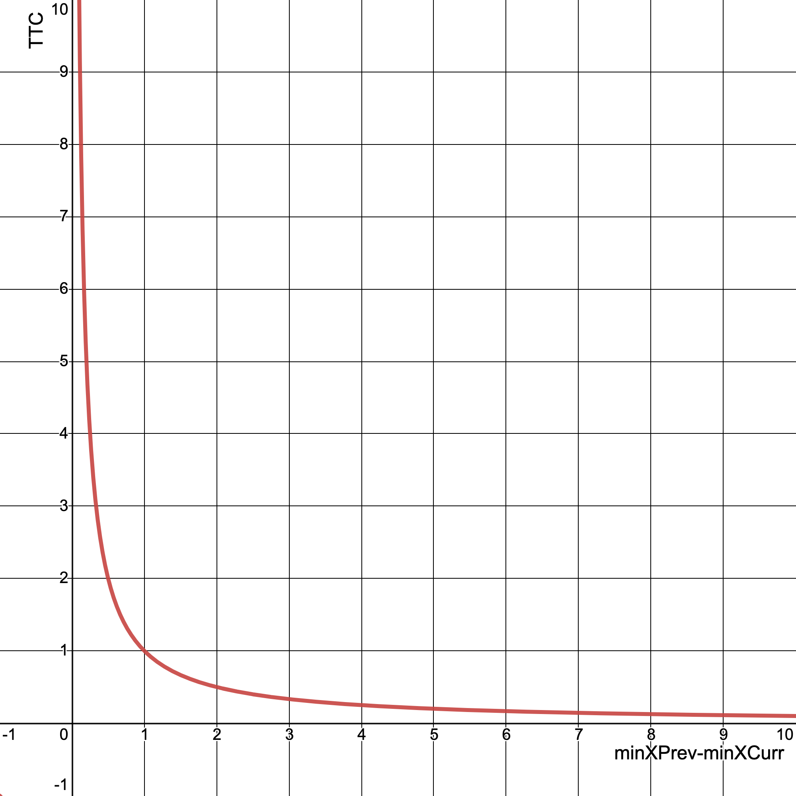

Template from https://github.com/udacity/SFND_3D_Object_Tracking/

# SFND 3D Object Tracking

Welcome to the final project of the camera course. By completing all the lessons, you now have a solid understanding of keypoint detectors, descriptors, and methods to match them between successive images. Also, you know how to detect objects in an image using the YOLO deep-learning framework. And finally, you know how to associate regions in a camera image with Lidar points in 3D space. Let's take a look at our program schematic to see what we already have accomplished and what's still missing.

In this final project, you will implement the missing parts in the schematic. To do this, you will complete four major tasks: 
1. First, you will develop a way to match 3D objects over time by using keypoint correspondences. 
2. Second, you will compute the TTC based on Lidar measurements. 
3. You will then proceed to do the same using the camera, which requires to first associate keypoint matches to regions of interest and then to compute the TTC based on those matches. 
4. And lastly, you will conduct various tests with the framework. Your goal is to identify the most suitable detector/descriptor combination for TTC estimation and also to search for problems that can lead to faulty measurements by the camera or Lidar sensor. In the last course of this Nanodegree, you will learn about the Kalman filter, which is a great way to combine the two independent TTC measurements into an improved version which is much more reliable than a single sensor alone can be. But before we think about such things, let us focus on your final project in the camera course. 

## Basic Build Instructions

1. Clone this repo.
1. `wget https://pjreddie.com/media/files/yolov3.weights -P dat/yolo/`
1. `wget https://pjreddie.com/media/files/yolov3-tiny.weights -P dat/yolo/`
1. Make a build directory in the top level project directory: `mkdir build && cd build`
1. Compile: `cmake .. && make`
1. Run specific mode with visualization: `./3D_object_tracking [SHITOMASI, HARRIS, FAST, BRISK, ORB, AKAZE, SIFT] [BRISK, BRIEF, ORB, FREAK, AKAZE, SIFT] [MAT_BF, MAT_FLANN] [SEL_NN, SEL_KNN] `
1. Run benchmark mode without visualization (It makes .csv files): `./3D_object_tracking`

## Project Rubric

#### FP.1 Match 3D Objects: Implement the method "matchBoundingBoxes", which takes as input both the previous and the current data frames and provides as output the ids of the matched regions of interest (i.e. the boxID property). Matches must be the ones with the highest number of keypoint correspondences.

Firstly, I count the number of times each prevBB matches each currBB.
For each currBB, I find the most matched prevBB.

#### FP.2 Compute Lidar-based TTC: Compute the time-to-collision in second for all matched 3D objects using only Lidar measurements from the matched bounding boxes between current and previous frame.

When I find the nearest lidar point from ego vehicle, I exclude the nearest 10% points to eliminate noise points.
Using the nearest distances at current and previous frames, I calculate the TTC.

#### FP.3 Associate Keypoint Correspondences with Bounding Boxes: Prepare the TTC computation based on camera measurements by associating keypoint correspondences to the bounding boxes which enclose them. All matches which satisfy this condition must be added to a vector in the respective bounding box.

Firstly, I find all matches where currKeypts are included in the bounding box.
At the same time, the distance between key points of matching is also calculated.
Next, I find the median distance.
I filter out the matches whose distance is far from the median.

#### FP.4 Compute Camera-based TTC: Compute the time-to-collision in second for all matched 3D objects using only keypoint correspondences from the matched bounding boxes between current and previous frame.

Using the knowledge of Lecture 2-2, I complete the code of `computeTTCCamera()`.
It uses distance ratios between matched keypoints.
Instead of using the mean of distRatios, I use the median of them, because median is usually robust to outliers.

#### FP.5 Performance Evaluation 1: LidarTTCs.csv

"LidarTTCs.csv" shows the result.
Although I tried to filter out noises, there are some fluctuations of TTC at image3 and image8.

I calculated the TTC following the constant velocity model.

`TTC = minXCurr * dT / (minXPrev-minXCurr)`

If `minXPrev` and `minXCurr` have simillar values(=The speed of ego car and the car in front is similar.), the TTC value changes dramatically as the denominator changes.

The graph below illustrates it well (Note. the graph assumes `minXCurr * dT = 1`). As `(minXPrev-minXCurr)` approaches zero, TTC changes very rapidly.

So, just small noise can incur big fluctuations of TTC.

#### FP.6 Performance Evaluation 2: CameraTTCs.csv

"CameraTTCs.csv" shows the result.
The result of HARRIS and ORB detectors looks bad.
This may be because fewer key points are extracted. (Refer matches.csv in the last project)

The result of SHITOMASI and AKAZE detectors looks good.
Their TTCs are consistent through the frames.
My top1 combination (FAST / BRIEF) in the last project looks also good in this project.

